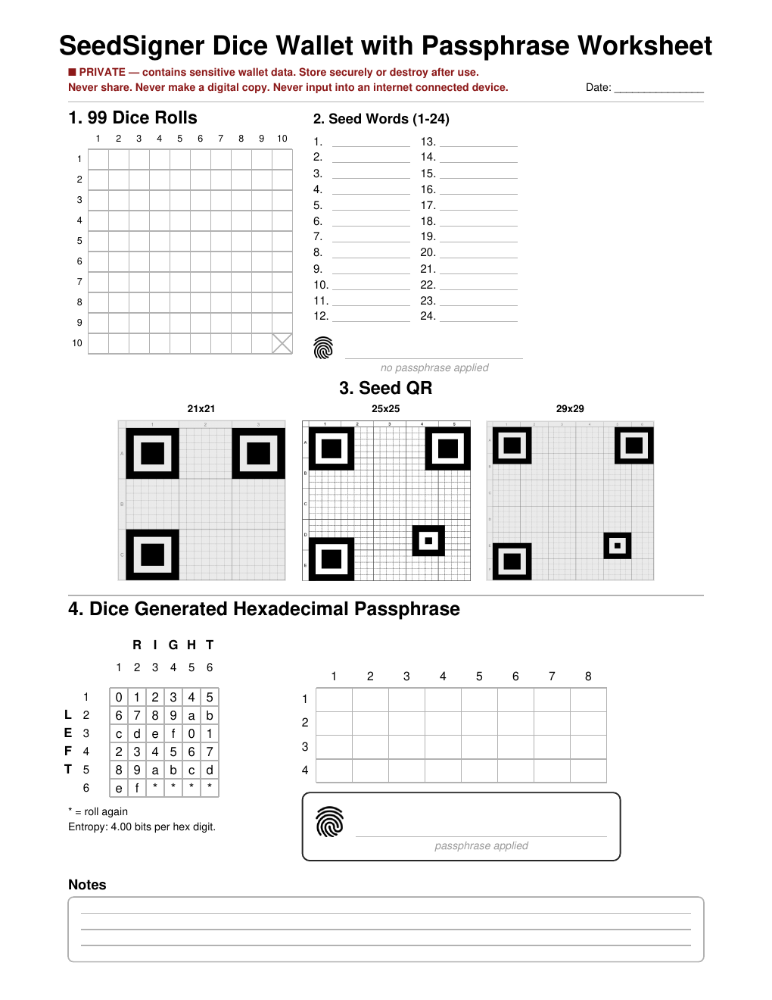

# Dice Wallet Worksheet

A one-page, print-ready worksheet for creating a [SeedSigner](https://seedsigner.com/)
Bitcoin wallet from physical dice rolls, including a dice-generated
hexadecimal BIP-39 passphrase.

Generates a single letter-size PDF with four sections:

1. **Dice Rolls** — a 10x10 grid for recording d6 rolls, supporting both
   50-roll (12-word) and 99-roll (24-word) seed flows.
2. **Seed Words** — numbered blank lines for the resulting BIP-39 mnemonic,
   plus a confirmation line for the seed's fingerprint.
3. **Seed QR** — three blank QR templates (21x21, 25x25, and 29x29)
   with 21x21 and 25x25 side-by-side on the first row and 29x29 centered
   beneath them, so all three templates can be larger while staying in the
   same worksheet area.
4. **Dice Generated Hexadecimal Passphrase** — a dice-to-hex lookup table
   (2 dice per digit, 4 bits of entropy per digit) and an 8x4 grid for
   recording a 32-digit (128-bit) passphrase, plus a boxed confirmation
   for the wallet's final fingerprint once the passphrase is applied.

A notes section with wide writing lines fills the remaining space at the
bottom of the page.

<p align="center">
  
</p>

## Usage

```bash
pip3 install -r requirements.txt
python3 generate_worksheet.py
```

The PDF is written to `output/dice_wallet_worksheet.pdf` by default. Use
`-o` to write elsewhere:

```bash
python3 generate_worksheet.py -o ~/Desktop/worksheet.pdf
```

## Layout notes

All layout math lives in `generate_worksheet.py`, organized as one
function per section (`draw_dice_grid`, `draw_seed_words`, `draw_seed_qr`,
`draw_hex_table`, `draw_passphrase_grid_and_fingerprint`, `draw_notes`).
Each function returns the y-coordinate(s) the next section needs, so the
page assembles top-to-bottom in `build()`. Shared constants (margins,
colors, title text) are collected at the top of the file.

## Assets

`assets/fingerprint.png` and the three QR template images are embedded
directly into the PDF rather than redrawn. The 25x25 template is the original
worksheet asset; the 21x21 and 29x29 templates are rendered from the supplied
PDF templates and lightly normalized for print-friendly grid-line contrast.
The original supplied 21x21 and 29x29 PDFs are also retained under
`assets/source_templates/`.

## Security

This worksheet is meant to hold sensitive wallet material once filled
out. Treat a completed copy the same as any other seed backup: store it
securely (e.g. safe, safety deposit box) or destroy it after transferring
the wallet to its permanent storage, never photograph or scan it, and
never enter its contents into an internet-connected device except through
SeedSigner's own dice-entry flow.
